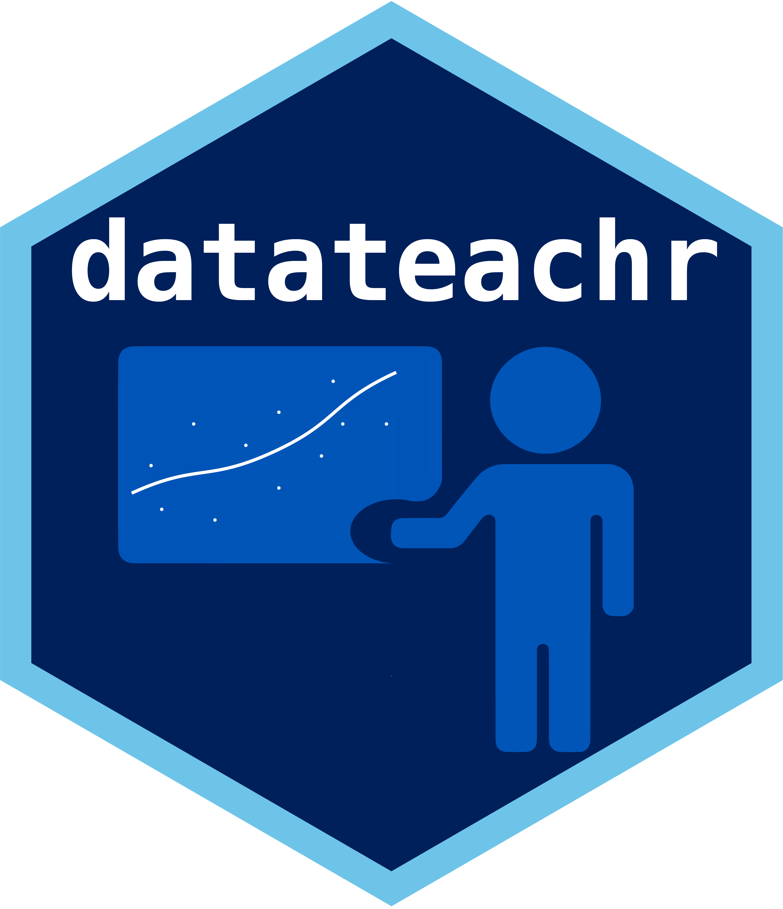

```{r, echo = FALSE, message = FALSE}
knitr::opts_chunk$set(collapse = T, comment = "#>")
library(datateachr)

```

# datateachr

<!-- badges: start -->

<!-- badges: end -->

_Pronounced "Data Teacher"_

The goal of `datateachr` is to provide an easy way to access open source data for educational purposes. This is semi-tidied data obtained from multiple sources included the City of Vancouver's Open Data Portal.

## Installation

You can install the development version from [GitHub](https://github.com/UBC-MDS/datateachr) with:

```{r eval=FALSE}
install.packages("devtools")
devtools::install_github("UBC-MDS/datateachr")
```

### Vignette 
You may also access this information through our vignette. First use this command for installation: 

```{r eval=FALSE}
install.packages("devtools")
devtools::install_github("UBC-MDS/datateachr", build_vignettes = TRUE)
```

And to read the vignette use: 

```{r eval=FALSE}
library(datateachr)
browseVignettes("datateachr")
```


This data was acquired courtesy of [The City of Vancouver's Open Data Portal](https://opendata.vancouver.ca/pages/home/). 


This package contains (currently) 3 datasets:

  * `vancouver_trees`: This dataset is currently still being updated by the city. It currently has `r nrow(vancouver_trees)` rows. 
  * `steam_games`: This dataset contains all the games available for download on Steam from 2019-06-16. It currently has `r nrow(steam_games)` rows. 
  * `building_permits`: This dataset is updated monthly for the current year (prior years are static). It currently has `r nrow(building_permits)` rows. 
 
## Example

This is a basic example which shows you how to solve a common problem:

```{r example, message=FALSE}
library(dplyr)
library(datateachr)


vancouver_trees %>% filter(genus_name == "ACER") %>% 
  arrange(desc(diameter)) %>% head()
```

or find out the summary statistics of the data:

```{r vancouver_trees}
summary(vancouver_trees)
```

## License

`datateachr`'s data is curated from multiple sources with many of the datasets aquired from the City of Vancouver Open Data Portal that uses the Open Government Licence - Vancouver license. See their [terms of use](https://opendata.vancouver.ca/pages/licence/). 

## Citation

Run this command to get info on how to cite this package.

```{r warning = FALSE}
citation("datateachr")
```

